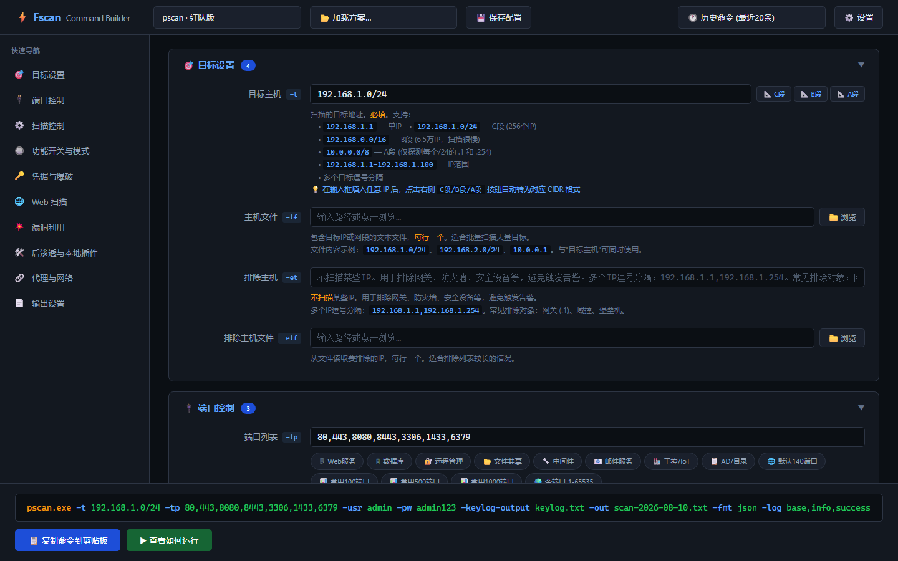
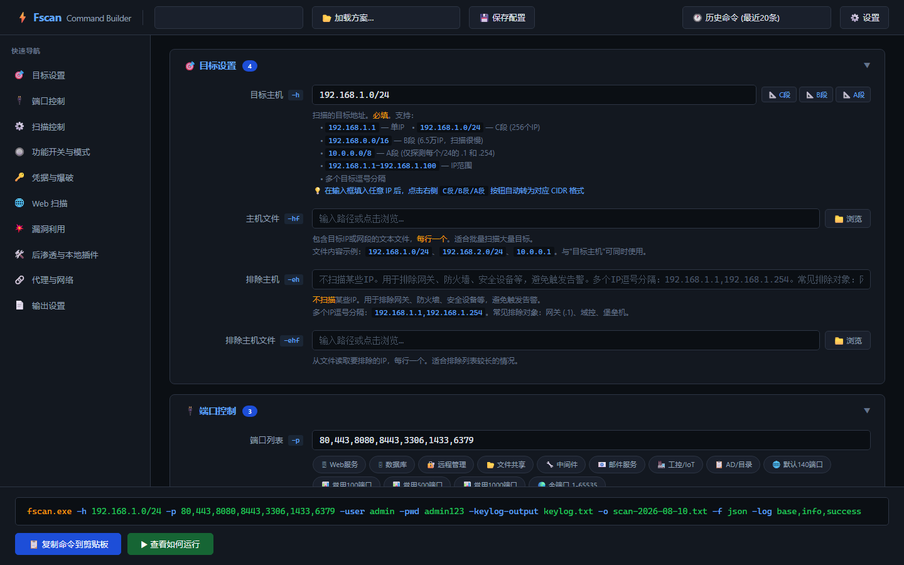
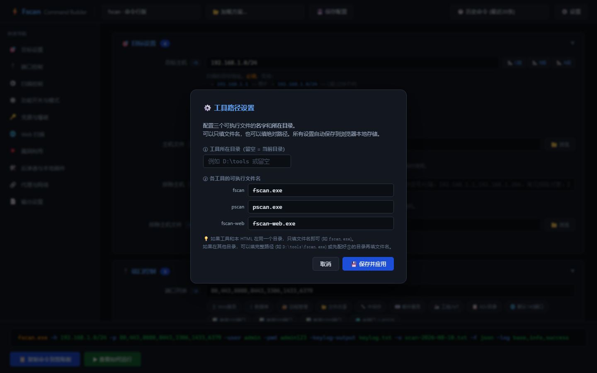

<div align="center">


# 🔧 Fscan Toolkit

**fscan 图形化管理工具套件 — 让 fscan 更易用、更专业**

[](LICENSE)
[](https://chu0119.github.io/fscan-toolkit/)
[](https://github.com/chu0119/fscan-toolkit/pulls)

两个**纯静态 HTML 文件**，双击浏览器打开即可使用 | **零依赖、零安装、零配置、离线可用**

</div>

---

## 📑 目录

- [是什么](#-是什么)
- [🔧 命令生成器](#-fscan-command-builderhtml)
- [📊 报告生成器](#-fscan-report-generatorhtml)
- [🚀 快速开始](#-快速开始)
- [📸 完整截图](#-完整截图)
- [📁 文件清单](#-文件清单)
- [❓ 常见问题](#-常见问题)
- [🔗 在线使用](#-在线使用)
- [⚠ 免责声明](#-免责声明)
- [🙏 致谢](#-致谢)

---

## 💡 是什么

[fscan](https://github.com/shadow1ng/fscan) 是一款非常优秀的内网综合扫描工具，但它有 **74 个命令行参数**，以及三个版本（fscan / fscan-web / pscan）的**参数名各不相同**，甚至存在**同名参数含义完全不同**的陷阱。

这个套件提供了两个工具来解决这个痛点：

| 工具 | 解决的问题 |
|------|-----------|
| **命令生成器** | 不用记参数、不用翻手册、不用担心 fscan↔pscan 参数名差异，点点选选生成正确命令 |
| **报告生成器** | 把 fscan 输出的原始 TXT/JSON/CSV 变成排版精美的专业安全报告，一键导出 PDF |

---

## 🔧 fscan-command-builder.html

### 交互式命令生成器

不记参数，不翻手册，不用怕 fscan 和 pscan 参数名不一样 —— 点点选选就生成正确命令。

### 核心功能

#### 🎛 三工具无缝切换

| 工具 | 说明 | 示例 |
|------|------|------|
| **fscan** | 标准命令行扫描工具 | 74 个命令行参数全覆盖 |
| **pscan** | 红队行动版（参数混淆） | 24 个参数名与 fscan 不同，自动映射 |
| **fscan-web** | Web 可视化管理平台 | 仅有 `-port` 和 `-lang` 两个参数 |

**自动参数映射**：选择 pscan 后，所有参数名自动从 fscan 的 `-h`/`-m`/`-user` 切换为 pscan 的 `-t`/`-st`/`-usr`，生成命令时自动使用正确参数名。

**同名冲突警告**：pscan 的 `-hf` 是哈希文件，fscan 的 `-hf` 是主机文件 —— 切换时界面会醒目高亮提示。

#### 📋 10 组折叠面板

按功能分类，与 fscan 官方手册结构一一对应：

| 面板 | 覆盖参数 |
|------|---------|
| 🎯 目标设置 | 目标主机、主机文件、排除主机、排除主机文件 |
| 🔌 端口控制 | 端口列表、端口文件、排除端口 |
| ⚙️ 扫描控制 | 模式、线程、超时、速率等 11 个参数 |
| 🔘 功能开关 | 仅存活、跳过探测、禁用爆破/POC 等 12 个开关 |
| 🔑 凭据与爆破 | 用户名、密码、字典、哈希、私钥等 11 个参数 |
| 🌐 Web 扫描 | URL、Cookie、User-Agent、POC 等 |
| 💥 漏洞利用 | Redis 利用、MS17-010、反弹Shell 等 |
| 🛠️ 后渗透 | 21 个本地插件、持久化、下载等 |
| 🔗 代理与网络 | HTTP/SOCKS5 代理、指定网卡 |
| 📄 输出设置 | 输出文件、格式、语言、调试等 |

#### 🎯 智能 IP → CIDR 转换

在目标主机输入框中输入任意 IP（如 `192.168.1.100`），点击右侧按钮：

- `📐 C段` → 自动转为 `192.168.1.0/24`
- `📐 B段` → 自动转为 `192.168.0.0/16`
- `📐 A段` → 自动转为 `192.0.0.0/8`

支持多目标逗号分隔场景（只替换第一个 IP）。

#### 📊 13 组端口预设

| 预设 | 端口数 | 典型端口 |
|------|--------|---------|
| 🖥 Web服务 | 8 | 80, 81, 443, 8080, 8443, 9090, 8000, 8888 |
| 🗄 数据库 | 6 | 3306, 1433, 5432, 6379, 27017, 1521 |
| 🔐 远程管理 | 6 | 22, 23, 3389, 5900, 5985, 5986 |
| 📂 文件共享 | 5 | 21, 139, 445, 873, 2049 |
| 🔧 中间件 | 7 | 7001, 7002, 8161, 5672, 61616, 2181, 9092 |
| 📧 邮件服务 | 7 | 25, 110, 143, 465, 587, 993, 995 |
| 🏭 工控/IoT | 6 | 502, 1883, 47808, 44818, 102, 20000 |
| 📋 AD/目录 | 6 | 53, 88, 389, 636, 3268, 3269 |
| 🌐 默认140端口 | 140 | fscan 内置默认 |
| 📊 常用100端口 | 100 | Top 100 高频端口 |
| 📊 常用500端口 | 500 | Top 500（含所有常见企业服务） |
| 📊 常用1000端口 | 1000 | 全范围覆盖（类似 nmap top-ports） |
| 🌍 全端口 | 65535 | `1-65535` |

#### 🗂 内置快捷预设

- **User-Agent**（5 个）：Chrome Win11、Firefox Win11、Chrome Mac、Safari iPhone、curl 8.x
- **域名**（4 个）：corp.local、domain.local、internal.corp、ad.company.com
- **发包速率**（4 个）：不限速、隐蔽 100/分、中速 500/分、快速 2000/分
- **线程数**（3 个）：隐蔽 100、默认 600、高速 1000

#### 🔗 条件联动

开关类参数会自动控制相关参数的显隐：

| 开关 | 效果 |
|------|------|
| `仅存活探测` | 折叠端口、爆破、Web、漏洞利用等面板 |
| `禁用爆破` | 隐藏整个凭据与爆破面板 |
| `禁用POC` | 隐藏 POC 相关字段 |

不会让用户填一堆无效参数，也不会出现互相矛盾的配置。

#### ⚙️ 可配置工具路径

不写死任何文件名或目录。点击右上角 `⚙️ 设置`：

- 填入工具所在目录（可选）
- 填入三个工具的 exe 文件名（可用绝对路径）
- 自动持久化到浏览器本地存储

#### 💾 配置方案保存/加载

把当前的参数配置保存为预设方案：

- **保存**：取名保存当前所有参数配置
- **加载**：从下拉菜单一键加载已保存的方案
- **跨会话**：数据存在 localStorage，关闭浏览器不丢失

#### 🕐 命令历史

自动记录最近 20 条生成过的命令，包含时间和工具名。

#### 📋 复制 & 运行

- **复制命令**：一键复制到剪贴板
- **运行说明**：弹窗指导如何切换到工具目录并运行

---

## 📊 fscan-report-generator.html

### 扫描报告生成器

把 fscan 输出的 TXT/JSON/CSV 拖进去，自动解析，一键生成排版精美的专业安全报告。

### 核心功能

#### 📂 拖拽上传

支持三种输入方式：

- **拖拽**：把文件拖到虚线区域
- **点击选择**：点击虚线区域打开文件选择器
- **示例数据**：下拉菜单加载内置示例，“进来了就能体验”

#### 🔍 智能解析

| 格式 | 支持情况 |
|------|---------|
| **TXT** | 按 `# ===== 节头 =====` 自动分节解析 |
| **JSON** | 自适应多种 schema 结构 |
| **CSV** | 标准 CSV 解析 |

解析内容包括：

- 存活主机列表
- 开放端口（按主机分组聚合）
- 服务识别结果
- Web 服务 URL 清单
- 漏洞发现（**自动风险定级**）

#### 🛡 自动风险定级

系统根据漏洞描述中的关键词自动标注风险等级：

| 等级 | 标签 | 触发关键词 |
|------|------|-----------|
| 🔴 严重 | 红色 | MS17-010、永恒之蓝、RCE、反序列化、任意文件上传 |
| 🟠 高危 | 橙色 | 弱口令、未授权访问、默认密码、SQL注入、命令注入 |
| 🟡 中危 | 黄色 | 版本泄露、不安全的配置、明文传输 |
| 🔵 信息 | 蓝色 | 其他信息性发现 |

报告中的漏洞表格按风险等级从高到低排序。

#### 🎛 7 组章节开关

报告预览前可以勾选要包含的内容：

- ✅ 首页统计总览
- ✅ 存活主机列表
- ✅ 开放端口明细（按主机分组）
- ✅ 服务识别结果
- ✅ Web 服务列表
- ✅ 漏洞发现（含风险等级标记，按严重度排序）
- □ 附录：原始扫描输出

不需要的章节取消勾选即可，预览实时更新。

#### 📝 自定义报告信息

- **报告标题**（默认"内网安全扫描报告"）
- **项目名称**（自动从文件名推断）
- **扫描人员**（填你的名字/ID）

#### 👁 实时预览

右侧白色预览区，所见即所得。报告包含：

- 首页 KPI 统计卡片
- 风险概览汇总（严重/高危/中危各多少条）
- 各章节数据表格
- 页脚生成时间和免责声明

#### 🖨 导出 PDF / 保存 HTML

- `Ctrl + P` → 打印为 PDF（带样式）
- `Ctrl + S` → 保存为独立 HTML 文件

---

## 🚀 快速开始

### 在线使用

直接访问 GitHub Pages：**[https://chu0119.github.io/fscan-toolkit/](https://chu0119.github.io/fscan-toolkit/)**

### 离线使用

1. 下载仓库（绿色 `Code` → `Download ZIP`）
2. 解压后在浏览器中打开：

```
fscan-command-builder.html      → 命令生成器
fscan-report-generator.html     → 报告生成器
```

### 命令生成器使用步骤

```
① 双击 fscan-command-builder.html 在浏览器中打开
② 点击右上角 ⚙️ 设置，填入你的工具文件名（可带路径）
③ 在左侧面板配置参数（填入目标、选端口、调参数）
④ 底部实时显示生成命令 → 点击 📋 复制命令
⑤ 粘贴到 PowerShell / CMD 中运行
```

### 报告生成器使用步骤

```
① 双击 fscan-report-generator.html 在浏览器中打开
② 把 fscan 输出的 result.txt（或 .json / .csv）拖到左侧
③ 勾选或取消想要包含的章节
④ 右侧预览报告 → Ctrl+P 打印为 PDF
```

---

## 📸 完整截图

### 命令生成器

<details open>
<summary><b>默认初始状态 — fscan 模式</b></summary>

</details>

<details>
<summary><b>填充参数 — 典型扫描场景</b></summary>

</details>

<details>
<summary><b>切换到 pscan — 参数名自动映射</b></summary>

</details>

<details>
<summary><b>切换到 fscan-web — 精简启动器</b></summary>

</details>

<details>
<summary><b>⚙️ 设置弹窗 — 配置工具路径</b></summary>

</details>

### 报告生成器

<details>
<summary><b>初始空白状态 — 拖拽区域</b></summary>

</details>

<details>
<summary><b>加载示例数据 — 完整报告预览</b></summary>

</details>

---

## 📁 文件清单

| 文件 | 大小 | 用途 |
|------|------|------|
| `fscan-command-builder.html` | ~80 KB | fscan/pscan/fscan-web 交互式命令生成器 |
| `fscan-report-generator.html` | ~30 KB | 扫描结果解析 & 专业报告生成器 |
| `fscan-manual.md` | 26 KB | fscan 命令行版完整中文手册 |
| `fscan-manual.docx` | 50 KB | fscan 手册 Word 版（精美排版） |
| `fscan-web-manual.md` | 7 KB | fscan-web Web版中文手册 |
| `fscan-web-manual.docx` | 42 KB | fscan-web 手册 Word 版 |
| `pscan-manual.md` | 19 KB | pscan 红队版完整中文手册 |
| `pscan-manual.docx` | 46 KB | pscan 手册 Word 版 |
| `README.md` | — | 本文件 |
| `LICENSE` | — | MIT 开源协议 |
| `screenshots/` | — | 截图目录 |
| `docs/` | — | 设计文档 |

---

## ❓ 常见问题

<details>
<summary><b>Q: 为什么工具路径不写死？</b></summary>

每个人下载的 fscan 版本不同、存放位置不同、文件名不同（如 `fscan_2.2.0_windows_x64.exe`、`fscan.exe` 等）。
点右上角 `⚙️ 设置` 自己配，存在浏览器 localStorage 里，不会丢。
</details>

<details>
<summary><b>Q: 在线版（GitHub Pages）能用吗？</b></summary>

完全能用。GitHub Pages 托管的是纯静态 HTML，加载的就是代码本身。
在线版生成的命令可以直接复制到你的本地终端运行。报告生成器也能正常上传文件解析。
所有数据都存在你自己的浏览器里，不会上传到任何服务器。
</details>

<details>
<summary><b>Q: pscan 和 fscan 参数名不一样怎么办？</b></summary>

命令生成器会自动处理。选择 pscan 后：
- 所有参数名自动切换（`-h` → `-t`、`-m` → `-st`、`-user` → `-usr` 等 24 组映射）
- 同名冲突的参数有醒目红色警告（如 pscan 的 `-hf` 是哈希文件，不是主机文件）
- pscan 没有的参数会标记"pscan无"并自动隐藏
</details>

<details>
<summary><b>Q: 报告生成器支持哪些输入格式？</b></summary>

- **TXT**：fscan 默认输出的 `result.txt`，按 `# ===== 节头 =====` 分节
- **JSON**：`-f json` 输出的结构化数据，自适应多种 schema
- **CSV**：`-f csv` 输出的表格数据
</details>

<details>
<summary><b>Q: 报告能导出吗？</b></summary>

能。两种方式：
1. `Ctrl + P` → 打印为 PDF（保留完整样式）
2. `Ctrl + S` → 保存为独立的完整 HTML 文件
</details>

<details>
<summary><b>Q: 离线能用吗？</b></summary>

完全能用。两个 HTML 文件是纯静态的，不依赖任何外部资源和网络连接。
下载到本地后双击即可在浏览器中打开使用。
</details>

<details>
<summary><b>Q: 浏览器兼容性？</b></summary>

支持所有现代浏览器：Chrome / Edge / Firefox / Safari。IE 不支持。
</details>

---

## 🔗 在线使用

本仓库已启用 **GitHub Pages**，可以直接在线使用：

### 🎛 [命令生成器 — 在线使用](https://chu0119.github.io/fscan-toolkit/fscan-command-builder.html)

### 📊 [报告生成器 — 在线使用](https://chu0119.github.io/fscan-toolkit/fscan-report-generator.html)

> 或者从 [项目主页](https://chu0119.github.io/fscan-toolkit/) 导航到具体工具。

---

## ⚠ 免责声明

本工具套件仅面向 **合法授权** 的企业安全建设行为。使用前请确保：

- ✅ 已获得目标所有者的 **书面授权**
- ✅ 符合当地法律法规
- ✅ **不对非授权目标扫描**
- ✅ 不用于任何非法入侵、破坏活动

**工具开发者不承担任何非法使用产生的后果。**

---

## 🙏 致谢

- [shadow1ng/fscan](https://github.com/shadow1ng/fscan) — fscan 原作者，优秀的内网扫描工具
- [webzzaa/pscan](https://github.com/webzzaa/pscan) — pscan 原作者，红队行动版
- [knownsec/404StarLink](https://github.com/knownsec/404StarLink) — fscan 所在的星链计划

---

<div align="center">
  <sub>Made with ❤️ for the security community</sub>
</div>
