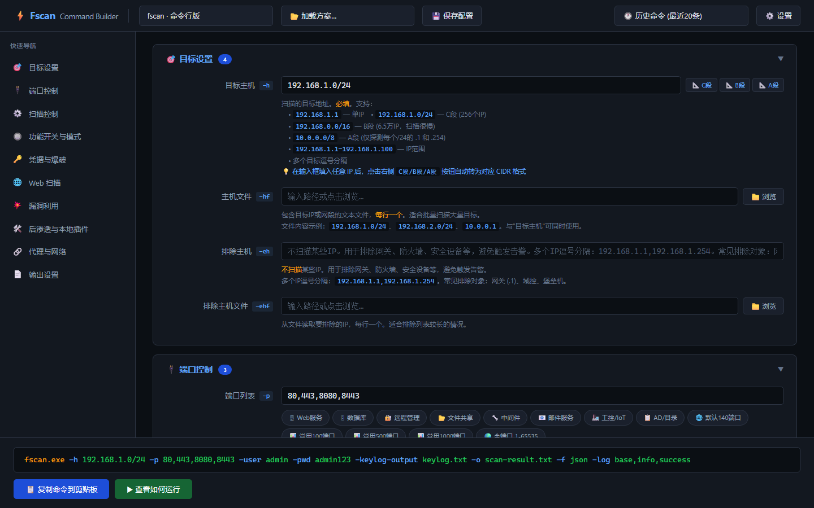

<picture>
  <source media="(prefers-color-scheme: dark)" srcset="screenshots/builder-dark.png">
  
</picture>

# Fscan Toolkit

**fscan 图形化管理工具套件** — 让 fscan 更易用。

两个纯静态 HTML 文件，双击浏览器打开即可使用，**零依赖、零安装、零配置**。

## 🔧 fscan-command-builder.html

**交互式命令生成器** — 不用记参数，点点选选就生成命令。

### 功能

- 🎛 三个工具切换：fscan / pscan / fscan-web，参数名自动对应
- 📋 10 组折叠面板，覆盖全部 74 个参数
- 🔗 智能联动：开关自动显隐依赖参数、别名冲突高亮警告
- 🎯 智能 CIDR：输入 IP 一键转 C段 / B段 / A段
- 📊 13 组端口预设：Web / 数据库 / 邮件 / 工控 / AD / 100 / 500 / 1000 常用端口
- 🗂 内置预设：UA / 域名 / 速率 / 线程一键填入
- 📋 点击复制命令 → 终端粘贴运行
- 💾 保存/加载配置方案（localStorage）
- 🕐 最近 20 条历史命令
- ⚙️ 可配置工具路径，不写死任何文件名或目录
- 🌓 深色主题

### 截图

---

## 📊 fscan-report-generator.html

**扫描报告解析器** — 拖入 result.txt / JSON / CSV，自动生成专业报告。

### 功能

- 📂 拖拽上传或点击选择 fscan 输出文件
- 🔍 自动解析 TXT / JSON / CSV 三种格式
- 🎛 7 组章节开关，勾选想包含的内容
- 📊 实时统计：存活主机、开放端口、服务、Web、漏洞数量
- 🛡 漏洞自动风险定级（严重🔴 / 高危🟠 / 中危🟡 / 信息🔵）
- 📝 可自定义报告标题、项目名称、扫描人员
- 👁 右侧实时预览，所见即所得
- 🖨 `Ctrl+P` 打印为 PDF 或 `Ctrl+S` 保存为完整 HTML
- 📋 内置示例数据，进来就能体验

### 截图

---

## 🚀 速开指南

### 命令生成器

1. 下载 `fscan-command-builder.html`
2. 双击在浏览器中打开
3. 点击右上角 `⚙️ 设置`，填入你的 fscan / pscan / fscan-web 的文件名（可带路径）
4. 左侧面板勾选参数 → 底部实时显示命令 → 点击 `📋 复制命令`
5. 粘贴到 PowerShell / CMD 中运行

### 报告生成器

1. 下载 `fscan-report-generator.html`
2. 双击在浏览器中打开
3. 把 fscan 输出的 `result.txt`（或 `.json` / `.csv`）拖到左侧虚线区域
4. 勾选要包含的章节
5. 右侧查看预览 → `Ctrl+P` 打印为 PDF

---

## 📁 文件清单

| 文件 | 用途 |
|------|------|
| `fscan-command-builder.html` | fscan/pscan/fscan-web 命令生成器 |
| `fscan-report-generator.html` | 扫描结果解析 & 报告生成器 |
| `fscan-manual.md` | fscan 命令行版完整手册 |
| `fscan-web-manual.md` | fscan-web Web版手册 |
| `pscan-manual.md` | pscan 红队版手册 |
| `fscan-manual.docx` | fscan 手册 Word 版 |
| `fscan-web-manual.docx` | fscan-web 手册 Word 版 |
| `pscan-manual.docx` | pscan 手册 Word 版 |

---

## ❓ 常见问题

### 为什么工具路径不写死？

每个人下载的 fscan 版本不同、存放位置不同、文件名不同。点右上角 `⚙️ 设置` 自己配，存在浏览器里，不会丢。

### 生成命令后怎么运行？

- 简单方案：点 `📋 复制命令` → 打开终端 → `cd` 到工具目录 → 粘贴运行
- 快速方案：点 `▶ 查看如何运行` 弹窗会告诉你具体步骤

### 报告生成器支持哪些格式？

- **TXT**：fscan 默认输出的 `result.txt`
- **JSON**：`-f json` 输出的结构化数据（自适应多种 schema）
- **CSV**：`-f csv` 输出的表格数据

### 报告能保存吗？

能。`Ctrl+S` 保存为完整 HTML 文件（独立可用），或 `Ctrl+P` 打印为 PDF。

---

## ⚠ 免责声明

本工具套件仅面向 **合法授权** 的企业安全建设行为。使用前请确保已获得授权，符合当地法律法规，**不对非授权目标扫描**。

fscan 原作者：[shadow1ng/fscan](https://github.com/shadow1ng/fscan)  
pscan 原作者：[webzzaa/pscan](https://github.com/webzzaa/pscan)

---

## 📄 License

MIT License — 详见 [LICENSE](LICENSE) 文件
